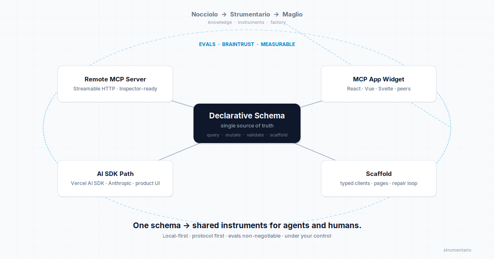

# Strumentario

**One schema → shared instruments for agents and humans.**



Strumentario is a local-first MCP content toolkit. One schema produces a remote Streamable HTTP server, MCP App widgets across major web frameworks, AI SDK product paths, and agentic scaffolds — all measurable with Braintrust and designed to sit between durable project knowledge (Nocciolo) and production factories (Maglio). Protocol first, product second, evals non-negotiable.

It treats MCP as a **durable content instrument layer** instead of another one-off tool adapter. Most options today solve the “make a server run” problem. Strumentario aims at the harder, more common problem: standing up a coherent, measurable, multi-surface set of instruments that agents and humans can actually share—and keeping that set under the developer’s control.

[](LICENSE)
[]()

---

## Goal

Give developers a single, declarative toolkit to:

- stand up a **remote MCP server** (Streamable HTTP) with real tools, resources, and prompts
- expose the same capabilities through an **MCP app widget** (ChatGPT Apps / MCP Apps path) across common web frameworks
- **scaffold** typed clients, pages, or studio stubs from a schema
- call the same tools from a **Vercel AI SDK / Anthropic** product surface
- measure quality with **Braintrust** golden traces and scaffold compile checks

Agents and humans share one coherent instrument set instead of reinventing the wiring every time.

The schema is the single source of truth that *generates* those surfaces: typed tool handlers, resource definitions, widget prop schemas, AI SDK tool definitions, and scaffold templates. Discovery and registration matter; coherence across protocol, product UI, product code path, and evals is the point.

Aligns with [Nocciolo](https://github.com/) (durable company-brain / memory config) and [Maglio](https://github.com/) (factory scaffold and assembly-line config). Nocciolo supplies durable context; Maglio shapes production systems; Strumentario provides the MCP instrument layer that both can use.

## The Problem

Building a useful MCP server is still too much boilerplate and too little product thinking.

Most teams either:

- copy a minimal stdio example and never ship a remote, multi-client surface
- treat the server as a throwaway adapter with no evals, no repair loop, and no human-facing UI
- rebuild the same query / mutate / validate / scaffold patterns for every new domain

The result is fragile tool surfaces that agents rediscover every session, UIs that drift from the protocol, and no measurable way to know whether a change improved tool selection or scaffold quality.

Generic MCP frameworks optimize for arbitrary tool authoring and boilerplate reduction. Content and knowledge domains keep re-implementing the same high-signal primitives — and almost never ship evals or a multi-surface story from one declarative core.

### Where other options leave developers

| Approach | What it optimizes for | Typical developer friction |
|----------|-----------------------|----------------------------|
| **Official SDKs + stdio examples** | Protocol compliance | Heavy plumbing; remote/multi-client rarely ships; no product surfaces or evals |
| **mcp-use** | Server + React MCP App widgets + scaffolder | Excellent DX for widgets and remote transport, but less emphasis on content primitives, AI SDK paths as equals, or eval-first measurability; cloud path is available |
| **MCP Framework / mcpkit-style** | Boilerplate reduction, discovery, multi-transport, auth | Strong server scaffolding; stops at “good tools”; little on widgets, scaffolds-as-capabilities, or golden-trace evals |
| **FastMCP (Python)** | Decorator DX and rapid tool servers | Great for Python tool servers; weak on React/TS product surfaces and the content-toolkit story |
| **Official MCP Apps kits** | Interactive UI resources / widgets | Strong on the widget layer; thinner on the full server + eval + scaffold loop |
| **Generation tools (e.g. mcp-anything)** | Auto-generate servers from APIs/code/NL | Fast start; weaker on ongoing ownership, local control, and measurable iteration |

Common outcome: developers still rebuild query / mutate / validate / list patterns per domain, ship fragile adapters, and have no reliable way to know whether a tool or scaffold change actually improved quality.

## The Vision

Strumentario starts from a schema (or a small set of domain resources) and produces:

1. A remote MCP server with **query, mutate, validate, and scaffold** as the product surface (not a grab-bag of demos)
2. An MCP app widget across major web frameworks (React, Vue, Svelte, and peers) that can be embedded in ChatGPT Apps (and similar hosts)
3. A CLI / skill pack that scaffolds a minimal app or studio from the same schema
4. A first-class product path using the Vercel AI SDK (or Anthropic) that calls the identical tools
5. A Braintrust suite with golden tool traces and compile/structure checks
6. Architecture notes, eval summaries, and failure postmortems that double as interview artifacts

Everything stays local-first and standards-first. You own the data, the hosting, and the evaluation criteria.

## How Strumentario differs

The MCP landscape already has strong remote servers (MCP Framework, FastMCP), excellent React widget runtimes and auto-registration (mcp-use, official MCP Apps kits), elegant zero-boilerplate tool definition (mcpkit-style frameworks), and fast generation paths from APIs or natural language. Competing on decorator elegance or the richest widget discovery path is a losing bet. Other projects mostly help you *build an MCP server* (or widgets on top of one). Strumentario is designed to help you *own a durable, measurable instrument set*.

### Differentiation bets

| Bet | Why it matters |
|-----|----------------|
| **Evals as product** | Braintrust golden traces, tool-choice scorers, and scaffold compile checks land *before* (or tightly with) human surfaces — not as an afterthought |
| **One schema → three surfaces + evals** | Protocol server, MCP App widgets across major web frameworks, and AI SDK product path are equal citizens generated from one declarative core |
| **Content-domain primitives** | query / mutate / validate / scaffold — a small high-signal set, not an unbounded tool catalog |
| **Scaffold + repair as an agent capability** | Schema → artifacts → compile/structure feedback → stop condition, measured in evals |
| **Knowledge ↔ instruments ↔ factory** | Explicit seams with Nocciolo (durable context instruments recall against) and Maglio (factories that call these tools overnight) |
| **Local control, hard** | Core loop works without a cloud control plane |
| **Craft artifacts as product** | Architecture notes and failure postmortems are deliverables, not leftover docs |

### How the local-first content toolkit helps

1. **Local control as the default, not an afterthought** — Core loop (server, schemas, evals, scaffolds) is self-hostable and version-controlled. No forced cloud runtime for the instruments themselves. Matches teams that already run local agents (Cursor, Claude Code, etc.) and want the same ownership model for the tools those agents call.

2. **Content primitives instead of “any tool”** — Productizes a small, high-signal set—query, mutate, validate, scaffold—rather than encouraging a large catalog of ad-hoc tools. These are the patterns content and knowledge domains keep re-implementing. Developers get a coherent instrument set instead of rediscovering the same shapes every project.

3. **One declarative core → multiple coherent surfaces** — A schema (or small set of domain resources) drives a remote Streamable HTTP MCP server (Inspector-ready, multi-client), MCP App widgets across major web frameworks, a thin Vercel AI SDK / Anthropic product path that calls the *same* tools, and CLI / skill scaffolding of typed clients, pages, or studio stubs. Protocol stays the source of truth; UIs and product code are views over it. Headless agents and human surfaces stay aligned.

4. **Measurability built in (Braintrust golden traces)** — Evals are not an optional later stage. Golden traces / datasets + tool-choice scorers + scaffold compile/structure checks make changes visible. Developers can answer “did this tool or scaffold change improve quality?” instead of relying on vibes or manual inspection.

5. **Progressive, craft-respecting path** — Remote server + Inspector first; evals next (so quality is measurable early); human surfaces (widget and/or AI SDK); then agentic scaffolding + repair loops. Traditional TypeScript architecture, tests, and reviews remain the baseline; agents amplify them. This avoids “prompt theater” and keeps the output reviewable.

6. **Clear place in a larger agentic stack** — Sits between durable project knowledge (Nocciolo / company-brain config) and production factories (Maglio). Developers who already curate ADRs, standards, and domain docs can turn that knowledge into instruments agents inherit, then later wire those instruments into structured overnight loops—without rebuilding the wiring each time.

7. **Portfolio- and contributor-ready artifacts** — Architecture notes, eval summaries, and failure postmortems are treated as product. For contractors and open-source contributors this turns the repo into both a working toolkit and a concrete demonstration of agentic engineering practice.

### Practical developer outcomes

- Faster path from “I need tools for this domain” to a remote, multi-client MCP surface that agents can already call
- Less repeated boilerplate around query/mutate/validate and surface wiring
- Same tools usable by Cursor/Claude Code *and* by a React widget or AI SDK UI without drift
- Confidence that tool and scaffold changes are measurable (via golden traces and scorers)
- Ownership stays local; no requirement to adopt a hosted control plane for the core instruments
- A clear growth path toward repair loops and tighter knowledge/factory integration without rewriting the foundation

**Why contribute here** instead of adjacent MCP projects: if you care about proving tools got better, keeping content primitives coherent across protocol and product surfaces, and building the instrument layer in a knowledge→instruments→factory stack, this is the repo that treats those as non-negotiable. If you want the fastest path to arbitrary tools + auto-registered React widgets, mcp-use and the official Apps kits already own that lane — we are not trying to out-run them there.

What we deliberately do **not** chase for differentiation: pure boilerplate reduction, richest widget auto-discovery, multi-tenant auth perfection, plugin marketplaces, full CMS parity, or becoming “the” agent runtime / memory system (that is Nocciolo / Maglio territory).

**Bottom line:** Other projects mostly help you *build an MCP server* (or widgets on top of one). Strumentario’s local-first content toolkit is designed to help you *own a durable, measurable instrument set*—the same tools agents and humans share—starting from schemas and progressing through remote protocol, evals, product surfaces, and scaffolding, while staying under your control and aligned with traditional engineering craft.

## What Strumentario Does

| Layer | Capability |
|-------|------------|
| **Schema** | Single declarative core → tools, resources, widget props, AI SDK defs, scaffold templates |
| **Server** | Streamable HTTP MCP server — high-signal tools, resources, prompts; Inspector-ready |
| **Surfaces** | MCP app widgets for major web frameworks (ChatGPT Apps / MCP Apps) + first-class AI SDK web path — views over the same tools |
| **Scaffold** | Schema → typed client / page / studio stub + repair loop |
| **Evals** | Braintrust golden traces, tool-choice scorers, scaffold compile checks |
| **Agent wiring** | Config snippets + skills / slash commands so Cursor, Claude Code, and peers can use the same instruments |
| **Docs** | Architecture, landscape notes, eval results, failure postmortems — written for contributors and hiring screens |

Later phases grow multi-schema support, event-driven updates, and tighter Nocciolo/Maglio integration.

## Quick Start (Coming Soon)

```bash
# From your project root (or a fresh directory)
npx @strumentario/cli init

# Scaffold a minimal remote MCP server + schema
strumentario scaffold --schema ./content-schema.ts

# Run the server (Streamable HTTP)
strumentario serve

# Emit agent host config + MCP Inspector instructions
strumentario mcp

# Run the Braintrust eval suite (requires keys)
strumentario eval
```

The CLI and packages are under active development. Goal: a working remote server + one surface + one eval path in under an hour once the foundation lands.

## Core Principles

- **Protocol first, product second** — the MCP tools, resources, and prompts are the source of truth; UIs and scaffolds are views over them
- **Local control** — self-hostable, version-controlled, no forced cloud runtime for the core loop
- **Measurable** — every meaningful change to tools or scaffolds should be visible in an eval run; evals ship before (or tightly with) human surfaces
- **High-signal content primitives** — query / mutate / validate / scaffold over a noisy miscellaneous catalog
- **Traditional craft + agents** — clear TypeScript architecture, tests, and reviews remain the baseline; agentic scaffolding amplifies that craft
- **Progressive** — start with a single remote server and Inspector; grow into MCP app widgets, AI SDK paths, and repair loops only when the foundation is solid
- **Complement, don’t compete** — designed to sit next to Nocciolo (knowledge) and Maglio (factory); not a replacement for either

## Status

Strumentario is in the earliest public stage. We are building in the open.

See [ROADMAP.md](./ROADMAP.md) for the phased plan, differentiation bets, and definition of done for v1.0. See [docs/braintrust-eval-details.md](./docs/braintrust-eval-details.md) for the Braintrust eval strategy. See [docs/nocciolo-brain-details.md](./docs/nocciolo-brain-details.md) for the Nocciolo / Hindsight project memory bank (`.nocciolo/`, MCP recall).

## Relationship to Nocciolo & Maglio

| Layer        | Project       | Role                                              |
|--------------|---------------|---------------------------------------------------|
| Knowledge    | Nocciolo      | Durable company brain / memory bank config        |
| Instruments  | Strumentario  | MCP content toolkit — tools, surfaces, scaffolds  |
| Production   | Maglio        | Factory scaffold and assembly-line config         |

**Intended seams (even before deep integration):** Nocciolo seeds durable context that Strumentario instruments can recall and validate against; Maglio factories can call Strumentario tools overnight as part of production assembly. Use them together or independently — the stack story should stay coherent either way.

## Contributing

Issues, ideas, and PRs are welcome once the foundation lands. For now the best way to help is feedback on the vision and the initial CLI surface.

## Author

Created by [zanuka](https://github.com/zanuka) (Michael Delucchi)

## License

Copyright © 2026 Michael Delucchi. Released under the [MIT License](LICENSE).
